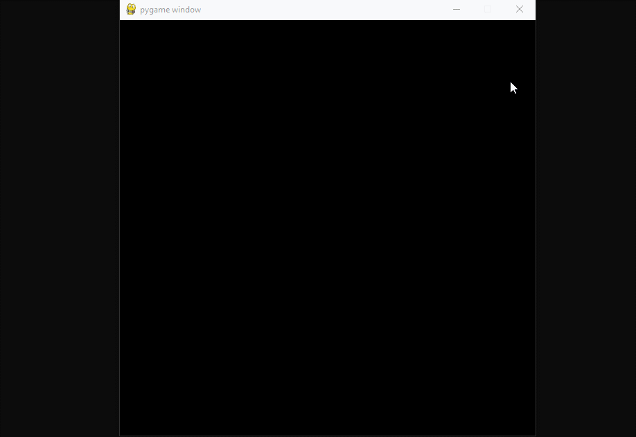

# Pygame-Swirly-Particles

Particle effects made in Python using Pygame.

## How to Use

- Run the script.
- Hold the **left mouse button** to generate colorful swirling particles at your mouse position.
- Particles rotate and move outward, disappearing after a short time.

## License

This project is licensed under the MIT License - see the [LICENSE](LICENSE) file for details.
